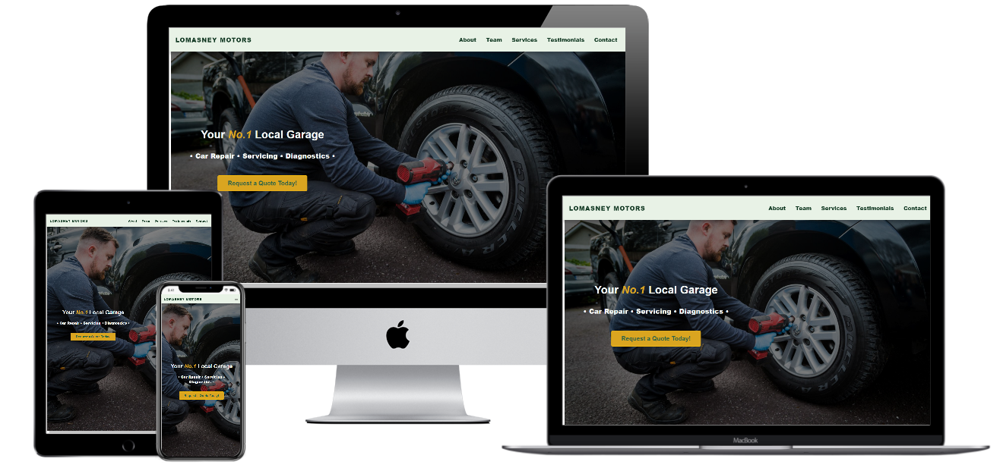

# **LOMASNEY MOTORS**
## **_Milestone 1 Project - User Centric Frontend Development_**

## **Description**
---
This is a fully responsive website I am developing for Lomasney Motors, a family run car service and repairs business based in Midleton, Co. Cork, Ireland.
The focus of this website is to provide customers with information about the business and to develop an online presence for the company. In 
this current climate with the challenges facing all businesses with COVID-19, it is vital stay connected with customers and is the key to securing the future 
of the business, it is important to develop a positive online presense to retain existing customers and also to attract new customers. The website is a single page 
scrolling website with 5 sections: About Us, Meet the Team, Services, Testimonials and a Contact section. This project will be on-going and will be updated 
regularly and changes made to suit the needs and requirements of both the owner and the users.

### **_The Business Objectives:_**
1. To develop an online presence.
2. Increase brand awareness.
3. Expand the target audience reach.
4. To showcase the services we offer.
5. Provide easily accessible information to customers.
6. To develop online communication with our customer base.

### **_Customer Objectives:_**
1. To gain access to services information
2. To access business opening hours and contact details.
3. To be able to get in touch with the business online.
4. To see customer reviews of the business and services provided.
5. Location information.
6. Easily access information required.

### **_Future goals:_**
* Ability to book a service online.
* Offer rewards and promotions to loyal customers.

## **UX Design**
---
This website is for customers, to provide up to date, relevant and easily available information about the business and the services it provides.
The objective of this project is to develop a user-friendly platform that both new and existing customers can use for a range of purposes which were
identified through research, from the perspective of the business and user perspective.

### **_User Stories_**

* As the owner of Lomasney Motors, I would like to develop a stronger online presence, so that I can expand my customer base while also sustaining open communication with my existing customers.

* As the owner I would like to provide basic company and service information to cut down on the amount of time spent on the phone during the working day as we only have one other member of staff currently employed and that time needs to be spent on the services and repairs.

* As an employee, I would like to provide up to date and informative content about our services to our existing customers and attract new customers by making the business more easily accessible.

* As a new user, I would like to know more about the company and what they offer so that I can see if I would be able to develop a rapport with them as this will be a service I will need on a regular basis.

* As a new user, I would like to know what services they offer and the prices of these services.

* As a new user I would like to see customer reviews of the service and the business so that I can determine the level of quality of the service. This service is important and I need to know that the company are trustworthy and professional.

* As a new user, I would like to see where they are located as I am new to the area and need to have this service within close proximity to where I live.

* As a potential user, I would like to be able to contact the business online as I have a very busy schedule and do not have alot of free time to call.

* As a potenial user I would like to be able to book in for a service online in advance to save time.

### **_Strategy_**
My goal for this project was to design a user friendly website focused on easily accessible key information for users and 
communicate with the business online. For the business my goal was to create a online platform for the business to build brand 
awareness and showcase their work. The design was intended to be easily to navigate, simple design and plenty of vivid imagery.

### **_Scope_**
The focus of the project, given the timeframe and my current skills, was to develop a one page scrolling website with 5 main sections
that users could easily navigate and provide information that was concise and relevant, provide a means of online communication through 
the use of a contact form and review modal,and a clear description of the services provided. It was important to include a brief background 
on the company and team as it is a local business it is the personal service they offer that sets them apart from bigger companies.  

### **_Structure_**
The website is designed to entice the users through plenty of vivid images and short paprgraphs of concise, relevant information that
do not overload the user with information. The services offered are displayed as images with large captions of the service provided.
Call to action buttons are placed on 3 different sections to encourage the user to communicate if they wish to do so. The footer also 
provides external links to the Facebook page, google maps for directions and a link to the company phone number. The layout is simple,
and a fixed navigation bar allows the user to quickly navigate to any section no matter where they are on the page.

### **_Skeleton_**
It is a one-page scrolling website with 5 different sections:
- Home Page
- About Section
- Meet the Team Section
- Services Section
- Testimonial Section
- Contact Section

#### **_Wireframe mockups_**
- [Wireframes](wireframes/wireframes-alldevices.pdf)

### **_Surface_**

#### **_Colours_**
>The colour scheme chosen for this project was based around the existing logo colours used by the company.
I used a mix of different shades of green and white for the body and backgrounds. And I used a yellow colour 
for the call to action buttons so they would be vibrant and stand out as intended to.

#### **_Typography_**
>The fonts chosen for this project were Montserrat and Raleway. The Montserrat font was the closest font to the
logo which the company already have in place so it was important to keep this element throughout the website.
These fonts pair well together, are easy to read and give a professional look to the site.

#### **_Images_**
>Most of the images were created solely for the purpose of this website. These were obtained from Bazar Productions 
with some minor generic images taken from [Unsplash](https://www.unsplash.com) and [Pexel](https://www.pexel.com) 
where images were required for the services section.

## **Features**
---
The website was built as a one page scrolling website that includes 5 different sections.

### **Navbar & footer**
 The **navigation bar** is in a fixed position to make it easy for users to access the navigation elements of the website and allow them to 
 move from section to section as they wish. The navbar consists of **logo text** to the left which **acts as a link to the homepage** and 
 is always visible on screen. The **navigation links** are lcoated to the far right, and provide scroll links to each section. The navbar 
 is responsive and the navigation menu collapses into a **hamburger menu** for both tablet and mobile devices.
 The **footer** includes **opening hours** details and **copyright information** to the left and links to **social media**, **telephone** and **direction** 
 information on the right. I initially had both the navbar and footer fixed however  I changed this design to the footer to cut down on 
 vertical space usage as it was obstructing content.

### **Home Page**
 The Hompage was designed to be a visual display with minimal text, it includes a **hero image**, a brief description highlighting 
 the main services the company provide which is jumbotron displayed over the hero image and a **call to action button** which provides
 a link to the contact form once clicked. The idea of the homepage is to visually entice the user while not bombarding them with an 
 overload of text to consume.

### **About Page**
The About page is set up as a two column grid display with the left side displaying three small paragraphs of text detailing a brief 
history and background of the business and a full width **image** of the owner and company signage to the right. I decided to use this image 
as it represents what the company is about, a family run local garage and enhances the personal feel of the business.

### **Services Page**
The services page is a 3 column display of **images** with a text underneath stating the services the company offer. There is an image to 
represent each service with a total of 9 services and correpsonding images displayed. In mobile view this has been reduced to one column 
with each service displayed as a block element, with one after the other.

### **Testimonials Page**
The testimonials page was designed using a Bootstrap carousel slider which runs automatically showcasing customer reviews. In larger screen sizes
a **call to action** button with the caption 'Leave a Review' has been added which when clicked opens a **modal dialog box** for users to write a review,
give it a star rating and submit it.

### **Contact Us Page** 
The contact us section is a two column page that includes a **contact form** on the left hand column and to the right I have included the business address, opening hours
and a basic **map** image showing the location of Lomasney Motors.

### **_Existing Features_**

 **_General_**
 - The navigation bar is displayed as fixed and is in view at all times on all devices for ease of access for users it contains the company logo text as 
 a link to the hompage and navigation links to the other sections to the right.
 The footer includes opening hours displayed to the left hand side and copyright information underneath this. Located to the left hand side are 3 icons
 with links to the company Facebook page, a telephone call link and a link to google map directions.

 **_Home Page_**
 - The homepage includes a hero image with an opaque overlay. It also contains a jumbotron with a brief few services highlighted and a call to action button
 that states 'Request a Quote' which directs the user to the contact section once clicked.

 **_About Section_**
 - The about section is designed as a two column container with section header and three small parapgraphs of text about the company to the left and on the right
 column there is an full width image of the company owner Dermot Lomasney.

 **_Services Section_**
 - The services section is a three column grid with 3 images aligned side by side and text with a semi-transparent background that states each services below each image.

 **_Testimonials section_**
 - This section is a featured as a automatic carousel slider displaying customer reviews including star ratings. Directly underneath the carousel slider there is a call to action
 button 'Leave a Review' highlighted in yellow, which once clicked opens a modal dialog box where users can leave a review on the website if they wish to do so.
 
 **_Contact Us Section_**
 - This section has a contact form feature to the left where users can get in touch with the company via email. It includes fields for name, email, phone no., car make, car model
 a message text area and a centered send button. To the right of the form there is some company information which features the business address, telephone no., and opening hours.
 Underneath the company information there is a simple basic map of the company location.

### **_Features Left to Implement_**
- Contact Form & Review modal functionality.
- COVID 19 Information - Provide information on how the company have adapted to the new Health & Safety Standards i.e the implementation of social distancing, santising and protecting 
customers on the premises.
- Booking service system - Allowing users to book a service through an online booking system platform
- Reward/offers for customers - Providing a signup feature that will allow loyal returning customers to gain acces to exclusive discounts or offers on services, giving back to the customer.
- GDPR Disclaimer - Implementing GDPR regulations when dealing with sensitive customer data and privacy.
- FAQ Page - Including a FAQ section so users can easily find answers to commonly asked questions quickly and with ease saving them time.
- Blog - An area to include some articles or information on common car issues or tips and tricks
- Cars for Sale Page - Lomasney Motors sometimes have used cars for sale, developing a section for online perspective buyers
- CAPTCHA feature on contact form - Allowing the business to protect against spam
- Customer database with service history - This would link up with the rewards for loyalty program and the business would have a database of customer history for ease of access and a user could
 also see their own car service history.

## **Technologies Used**
---
### **_Languages_**
- HTML5
- CSS3
- JQuery - the project used this as a built in feature of Bootstrap, used for the modal feature for the testimonial section.

### **_Integretions_**
- Bootstrap4 
  Used for the grid layout for the website
- Font Awesome
  Used to add icons to my footer and sections of the website
- Google Fonts
  Used to select the font styles used on the website for the section heading and body.

### **_Workspace_**
- GitHub
- Gitpod
- Git

### **_Other_**
- Autoprefixer CSS
  An online tool used to parse the CSS and add vendor prefixes where required.
- Tinyjpeg
  This was used to compress the images used on the website.

## **Testing**
---
In this section, you need to convince the assessor that you have conducted enough testing to legitimately believe that the site works well. Essentially, in this part you will want to go over all of your user stories from the UX section and ensure that they all work as intended, with the project providing an easy and straightforward way for the users to achieve their goals.

Whenever it is feasible, prefer to automate your tests, and if you've done so, provide a brief explanation of your approach, link to the test file(s) and explain how to run them.

For any scenarios that have not been automated, test the user stories manually and provide as much detail as is relevant. A particularly useful form for describing your testing process is via scenarios, such as:

1. Contact form:
    1. Go to the "Contact Us" page
    2. Try to submit the empty form and verify that an error message about the required fields appears
    3. Try to submit the form with an invalid email address and verify that a relevant error message appears
    4. Try to submit the form with all inputs valid and verify that a success message appears.

In addition, you should mention in this section how your project looks and works on different browsers and screen sizes.

You should also mention in this section any interesting bugs or problems you discovered during your testing, even if you haven't addressed them yet.

If this section grows too long, you may want to split it off into a separate file and link to it from here.
## **_Issues_**
- Navbar background color
- Navbar toggle menu collapsing
- Carousel slides overlapping
- Contact Image not fully covering section

## **Deployment**
---
This section should describe the process you went through to deploy the project to a hosting platform (e.g. GitHub Pages or Heroku).

In particular, you should provide all details of the differences between the deployed version and the development version, if any, including:
- Different values for environment variables (Heroku Config Vars)?
- Different configuration files?
- Separate git branch?

In addition, if it is not obvious, you should also describe how to run your code locally.

## **Credits**
---
- W3 Schools
- Stackoverflow
- Bootstrap
- Baz Alrawi - Images
- Cillian McCarthy - services content
- Balsamiq wireframes

### **_Content_**
- The text for the 'About Us', 'Meet the Team' and Services section were obtained from Dermot Lomasney, Cillian McCarthy, 
the owner and employee at Lomasney Motors and some text was added by me from my knowledge of the business and the surrounding area of Midleton.
The testimonials content was taken from the company Facebook review section and also reviews from Google.

### **_Media_**
- The photos used in this site were obtained from Basil Alrawi, who I enlisted to take some quality photos for the website.

## **Acknowledgements**
---
- My inspiration for this project came from my Dad. He is the owner of Lomasney Motors since 1987 and the business has never had a website.
  He has many regular customers, however as society has changed alot in the last 30 years, Midleton has now a much bigger population and the
  surrounding area has grown exponentially. It is important today for any business to have an online presence as customers will now 
  search online to find the service they are looking for. I have seen the business Lomasney Motors go from strength to strength during the 
  recession and the covid 19 pandemic. Now more than ever I thought it would be a good idea to put my skills to some real \
  life use and build a simple yet effective website that will allow the business to expand its customer base and showcase what the services they offer.
